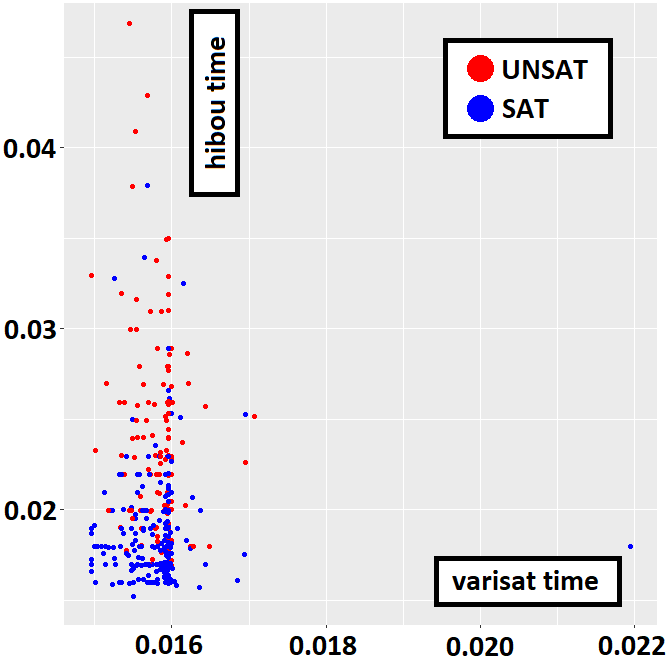
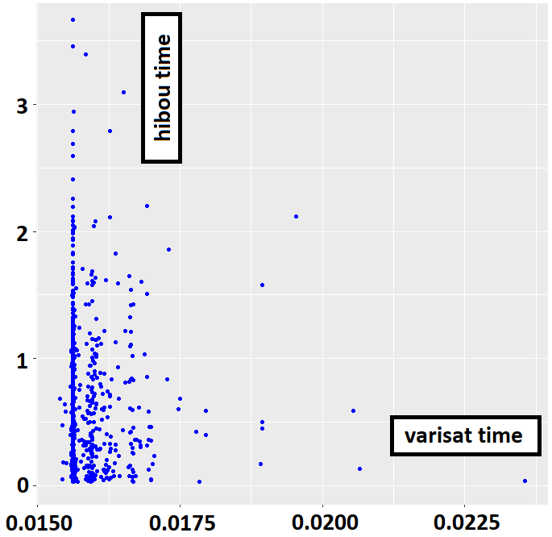
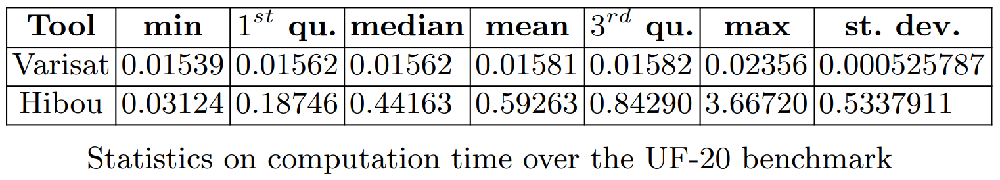

# Experimental validation of HIBOU's analysis algorithm with hiding via a reduction of 3SAT

This set of experiments constitutes an experimental validation of HIBOU's analysis algorithm with hiding.
It consists in testing the reliability of the algorithm (i.e. whether it returns a *Pass* or a *Fail*) on a set of problems of which we know the answer.
Those problems are obtained via reduction from benchmarks of 3SAT problems.

A boolean satisfiability problem consists in assessing whether or not a boolean expression (made of boolean variables, disjunctions and cunjunctions) is satisfiable i.e. whether or not there exists an assignment of variables such that the resulting expression holds true.

A 3SAT problem is a particular kind of boolean satisfiability problem in which the expression takes the form of a cunjunction of clauses, each of which being a disjunction of three literals.

In our paper we propose a reduction that transform a 3SAT problem into a problem of analysing a multi-trace w.r.t. an interaction model.
This latter problem can be solved by HIBOU.

In the context of verifying executions of distributed systems (made of subsystems which communicate asynchronously):
- multi-traces are sets of local traces, each corresponding to a sequence of communication actions (emissions or receptions of messages) that are observed locally on a specific subsystem. 
A multi-trace is hence a collection of local observations of the same global behavior (which is what was executed in the distributed system).
- interaction models are formal models that can be graphically represented in a fashion similar to UML sequence diagrams.

See "[hibou_label](https://github.com/erwanM974/hibou_label)" for the tool that is experimented on.

## Input 3SAT problem benchmarks

In those experiments, we use two benchmarks of 3SAT problems which consist of sets of ".cnf" files in each of which a 3SAT problem is encoded in the
[DIMACS format](https://people.sc.fsu.edu/~jburkardt/data/cnf/cnf.html).

Those two benchmarks are:
- the UF20 benchmark from the [SATLIB set of benchmarks](https://www.cs.ubc.ca/~hoos/SATLIB/benchm.html).
This benchmark contains 1000 problems that have 20 variables and 91 clauses. All of them are satisfiable i.e. we expect a *Pass*.
- a custom benchmark of 3SAT problems which we generate using the "sat3_generator.py" Python script.
This benchmark contains problems that have between 3 and 8 variables and between 3 and 39 clauses with both satisfiable and unsatisfiable instances

## Reduction towards multi-trace analysis

With the "sat3_to_membership.py" Python script we generate, for each ".cnf" file encoding a 3SAT problem, a ".htf" file containing a multi-trace and a ".hsf" file containing an interaction model.

Those two files, taken together as input by Hibou encode a multi-trace analysis problem which resolution equates that of the original 3SAT problem.
Here, if Hibou returns "*WeakPass*" (because recognizing a prefix of accepted multi-trace is enough) then it signifies that the 3SAT problem is SAT.
If it returns "*Fail* then the 3SAT problem must be UNSAT.

## Comparing outcomes w.r.t. those of a SAT solver

With the "sat3_calls.py" Python script we compare, for each problem, the outputs and time taken by:
- Hibou to solve the multi-trace analysis problem
- Varisat, a SAT solver, to solve the corresponding 3SAT problem

For each benchmark, we generate a ".csv" file containing the experimental data. Each line contains:
- the name of the problem
- the output of varisat i.e. either SAT (True) or UNSAT (False)
- the time taken by varisat (in seconds)
- the output of hibou i.e. either *WeakPass* (True) or *Fail* (False)
- the time taken by hibou (in seconds)

In order to smooth the results, we retain, for each run, the median of 5 tries, as the time required for the analysis.

## Results

In the following we present results obtained running the experiment on an i5-8250U processor and 32Go of RAM.
We have used HIBOU version 0.7.4 and Varisat version 0.2.1.
The raw data that we obtained is given in the "sat_membership_experiment_mahe.csv" and "sat_membership_experiment_uf20.csv" files respectively for the custom and uf20 benchmark.

With the "compare_varisat_hibou.r" R script we plot the data contained in the previously generated ".csv" files.
In the diagrams below, each point corresponds to a given 3-SAT problem,
with its position corresponding to the time required to solve it (by Varisat on the *x* axis and Hibou on the *y* axis).
Points in *red* are unsatisfiable problems while those in *blue* are satisfiable.

With both benchmarks we can observe that Hibou systematically returns the correct result whether the problem is satisfiable or unsatisfiable.

Below are represented the results for the custom benchmark.

 
And the second diagram (below) shows the results on UF20.

With the custom benchmark, which contains relatively small problems, we can observe that Hibou remains relatively competitive.
However, with UF20, which contains bigger problems, the performance gap widens considerably.

It is interesting to note that, although the tool is not designed to solve such problems,
with some optimisations Hibou can pass benchmarks such as SATLIB's UF-20 in reasonable time.
Given the generality and complexity of the problem which our tool solves
(multi-trace membership against interactions) those results are still promising w.r.t. its performances.

Detailed statistics are given below:

