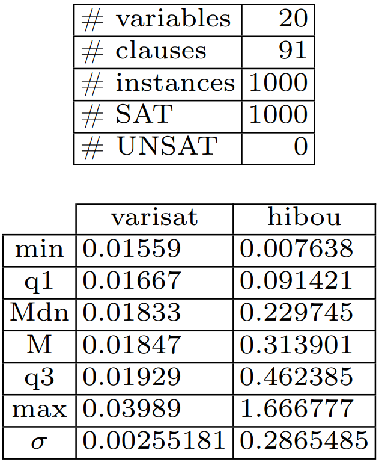

# Experimental validation of HIBOU's analysis algorithm with hiding via a reduction of 3SAT

This set of experiments constitutes an experimental validation of HIBOU's analysis algorithm with hiding.
It consists in testing the reliability of the algorithm (i.e. whether it returns a *Pass* or a *Fail*) on a set of problems of which we know the answer.
Those problems are obtained via reduction from benchmarks of 3SAT problems.

A boolean satisfiability problem consists in assessing whether or not a boolean expression (made of boolean variables, disjunctions and cunjunctions) is satisfiable i.e. whether or not there exists an assignment of variables such that the resulting expression holds true.

A 3SAT problem is a particular kind of boolean satisfiability problem in which the expression takes the form of a cunjunction of clauses, each of which being a disjunction of three literals.

We propose a reduction that transform a 3SAT problem into a problem of analysing a multi-trace w.r.t. an interaction model.
This latter problem can be solved by HIBOU.

In the context of verifying executions of distributed systems (made of subsystems which communicate asynchronously):
- multi-traces are sets of local traces, each corresponding to a sequence of communication actions (emissions or receptions of messages) that are observed locally on a specific subsystem. 
A multi-trace is hence a collection of local observations of the same global behavior (which is what was executed in the distributed system).
- interaction models are formal models that can be graphically represented in a fashion similar to UML sequence diagrams.

See "[hibou_label](https://github.com/erwanM974/hibou_label)" for the tool that is experimented on.

## Short description of the problem reduction

In the example below (on the left of the image) we have a 3SAT problem with 3 boolean variables *x1*, *x2* and *x3* and 4 clauses, each of which being a disjunction of 3 literals.
We reduce the satisfiability of this boolean formula to the problem of analyzing a multitrace against an interaction displayed on the right of the image below.

Let us compare both problems:
- there are 4 clauses and 4 lifelines: each clause corresponds to a lifeline
- there are 3 variables and three 'alt' combined fragments/oprators : each variable corresponds to an 'alt' operator
- there are 3 literals per clause and 3 reception events on each lifeline: each literal appearing on a clause corresponds to a reception event in the corresponding lifeline
- for a clause to hold true at least one of the three literals must hold true, and we have one reception event per lifeline on the multi-trace

The gist of the reduction can be explained by the graphical depiction below, please refer to the paper for more details.

## Input 3SAT problem benchmarks

In those experiments, we use three benchmarks of 3SAT problems which consist of sets of ".cnf" files in each of which a 3SAT problem is encoded in the
[DIMACS format](https://people.sc.fsu.edu/~jburkardt/data/cnf/cnf.html).

Those three benchmarks are:
- the UF20 benchmark from the [SATLIB set of benchmarks](https://www.cs.ubc.ca/~hoos/SATLIB/benchm.html).
This benchmark contains 1000 problems that have 20 variables and 91 clauses. All of them are satisfiable i.e. we expect a *Pass*.
- two custom benchmarks of 3SAT problems which we generate using an ad-hoc Python script. 
This script is present in the repository and generates random 3SAT problem without particular care or expertise.
Because the generation of random you might have different problems generated by re-running the experiments.
In any case, the two benchmarks which we have generated using this script are:
  - a 'small' one with problems having between 3 and 10 variables and between 4 and 50 clauses.
When we used the script for the generation, we obtained a benchmark containing a total of 663 instances, 376 of those being SAT and 287 being UNSAT.
  - a 'big' one with problems having between 20 and 27 variables and between 40 and 100 clauses
When we used the script for the generation, we obtained a benchmark containing a total of 790 instances, 488 of those being SAT and 302 being UNSAT.

## Reduction towards multi-trace analysis

With a Python script (in the repository) we generate, for each ".cnf" file encoding a 3SAT problem:
- a "hsf" signature file containing the signature of the corresponding interaction model i.e. definitions of lifelines and messages
- a "hif" interaction file containing the syntax of the corresponding interaction model i.e. its structure
- a "htf" trace file containing the corresponding multi-trace 

Those three files, taken together as input by Hibou encode a multi-trace analysis problem which resolution equates that of the original 3SAT problem.
Here, if Hibou returns "*WeakPass*" (because recognizing a prefix of accepted multi-trace is enough) then it signifies that the 3SAT problem is SAT.
If it returns "*Fail* then the 3SAT problem must be UNSAT.

Analyses have a default configuration but we can provide a custom configuration via using a "hcf" configuration file.
Because we want to use the algorithm with hiding steps here, we must specify it in a configuration file.

In order to test a feature of 'local analysis' of the tool, we use two different configurations of the analysis algorithm which are encoded in the files:
- "conf_noloc.hcf" for not using 'local analyses'
- "conf_wtloc.hcf" for using 'local analyses'

Concretely, we run two instances of hibou in parallel with both configurations.
When the quickest terminates we kill the slowest and take note of which configuration is quicker.

## Comparing outcomes w.r.t. those of a SAT solver

With Python we compare, for each problem, the outputs and time taken by:
- Hibou to solve the multi-trace analysis problem
- Varisat, a SAT solver, to solve the corresponding 3SAT problem

In order to smooth the results by removing noise, we perform several tries (5) for each method.
We then consider the median time required for the analysis between those 5 tries for plotting the results.

For each benchmark, we generate a ".csv" file containing the experimental data. Each line contains:
- the name of the problem
- the output of varisat i.e. either SAT (True) or UNSAT (False)
- the time taken by varisat (in seconds) for each of the 5 tries
- the median time taken by varisat (in seconds)
- the output of hibou i.e. either *WeakPass* (True) or *Fail* (False)
- the number of nodes explored during the analysis
- the length of the trace (actually corresponds to the number of clauses and lifelines)
- the time taken by hibou (in seconds) for each of the 5 tries
- the quickest of the two configuration used by hibou for each of the 5 tries
- the median time taken by hibou (in seconds)

Below is given an example excerpt of the tables which are generated during the experiment:

Let us remark that:
- for the custom benchmarks, the number of variables and clauses as well as the satisfiability of the problem are given by the problem's name.
- for the UF-20 benchmark all the problems have 20 variables and 91 clauses and are all satisfiable

## Results

In the following we present results obtained running the experiment on an i5-8250U processor and 32Go of RAM.
We have used HIBOU version 0.8.0 and Varisat version 0.2.1.

The raw data that we obtained is in the 'results' archive.

With the R code comprised in this repository, we extract statistical information from the "csv" tables that are generated
and draw scatterplots to represent the results graphically.

In those plots, each point corresponds to a given 3-SAT problem,
with its position corresponding to the (median) time required to solve it (by Varisat on the *x* axis and Hibou on the *y* axis).
Points in *red* are unsatisfiable problems while those in *blue* are satisfiable.

With all benchmarks we can observe that Hibou systematically returns the correct result whether the problem is satisfiable or unsatisfiable.

Below are represented the results:

|               | Statistical Data | Scatter-plot  |
|---------------|------------------|---------------|
| Custom small  |  |  |
| Custom big    |  |  |
| UF-20         |  |  |

Of course HIBOU is not designed to solve 3SAT problems and for benchmarks such as UF20 it is not a competitive means to solve 3SAT problem.
This set of experiments can be justified only by the fact of being interesting and
only serves as a form of experimental validation of the tool.

It is interesting to note that, although the tool is not designed to solve such problems,
with some optimisations HIBOU can pass benchmarks such as SATLIB's UF-20 in reasonable (for a human) time.
Given the generality and complexity of the problem which our tool solves
(multi-trace analysis against interactions) those results are still promising w.r.t. its performances.

## How to use

To obtain the data (the csv files):
- use main.py to generate the data from scratch
- or use that found in the 'results' archive

Use the R scripts to plot the data found in the csv files.

